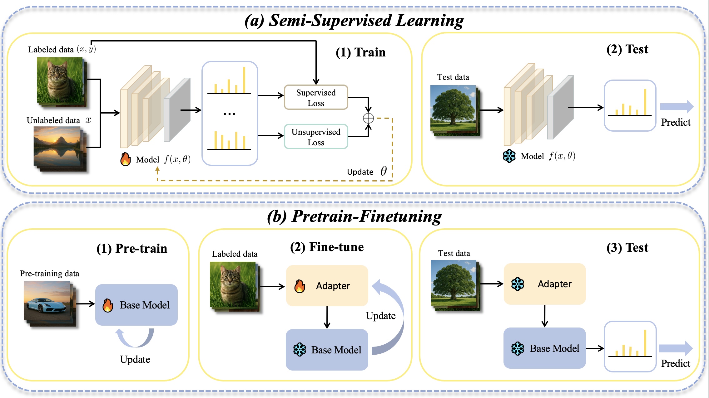

# Unlabeled Data or Pre-trained Model: Rethinking Semi-Supervised Learning and Pretrain-Finetuning

The official code for the paper "Unlabeled Data or Pre-trained Model: Rethinking Semi-Supervised Learning and Pretrain-Finetuning".



## How to install

This code is built on top of [PromptSRC](https://github.com/muzairkhattak/PromptSRC) and the awesome toolbox [Dassl.pytorch](https://github.com/KaiyangZhou/Dassl.pytorch).

```bash
cd Dassl.pytorch/

# Create a conda environment
conda create -y -n ssl_or_pretrain python=3.8

# Activate the environment
conda activate ssl_or_pretrain

# Install torch (requires version >= 1.8.1) and torchvision
# Please refer to https://pytorch.org/ if you need a different cuda version
conda install pytorch torchvision cudatoolkit=10.2 -c pytorch

# Install dependencies
pip install -r requirements.txt

# Install this library (no need to re-build if the source code is modified)
python setup.py develop

cd ..
```

Then install the requirements of [PromptSRC](https://github.com/muzairkhattak/PromptSRC)

```bash
pip install -r requirements.txt
pip install setuptools==59.5.0
```

## How to run

We provide key scripts to run the experiments. After activating the `ssl_or_pretrain` environment, you can run files ending with `.sh` to reproduce the results. For example:

```bash
sh run_ssl.sh
sh run_openset.sh
sh run_openworld.sh
sh run_lt.sh
```

As for classical semi-supervised learning algorithms, you can refer to the following repositories for configuration and reproduction:

- [FixMatch](https://github.com/google-research/fixmatch)
- [OwMatch](https://github.com/niusj03/owmatch)


